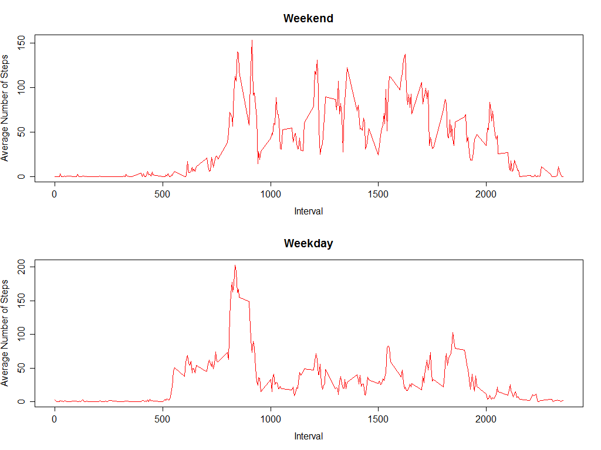

---
title: "Reproducible Research Project 1"
author: "datascience11"
date: "January 9, 2016"
output: pdf_document
---

It is now possible to collect a large amount of data about personal movement using activity monitoring devices such as a Fitbit, Nike Fuelband, or Jawbone Up. These type of devices are part of the "quantified self" movement - a group of enthusiasts who take measurements about themselves regularly to improve their health, to find patterns in their behavior, or because they are tech geeks. But these data remain under-utilized both because the raw data are hard to obtain and there is a lack of statistical methods and software for processing and interpreting the data.

This assignment makes use of data from a personal activity monitoring device. This device collects data at 5 minute intervals through out the day. The data consists of two months of data from an anonymous individual collected during the months of October and November, 2012 and include the number of steps taken in 5 minute intervals each day.

The variables included in this dataset are
    
steps: Number of steps taking in a 5-minute interval (missing values are coded as NA)

date: The date on which the measurement was taken in YYYY-MM-DD format

interval: Identifier for the 5-minute interval in which measurement was taken

The dataset is stored in a comma-separated-value (CSV) file and there are a total of 17,568 observations in this dataset.

##Load the data and transforming into a format suitable for analysis


```r
activity <- read.csv("activity.csv", header = TRUE, sep = ",")
activity$date = as.Date(activity$date)
activity$date <- strftime(activity$date, "%m-%d-%Y")
total_steps <- aggregate(steps ~ date, data = activity, sum, na.rm=TRUE)
```

##Calculate the total number of steps taken per day


```r
total_steps <- aggregate(steps ~ date, data = activity, sum, na.rm=TRUE)
```

##Make a histogram of the total number of steps taken each day


```r
hist(total_steps$steps, xlab = "Total Number of Steps Taken", ylab = "Count", main = "Total Number Steps Taken by Date", ylim = c(0,30))
```


##Calculate and report the mean and median of the total number of steps taken per day


```r
summary(total_steps$steps)
```

```
##    Min. 1st Qu.  Median    Mean 3rd Qu.    Max. 
##      41    8841   10760   10770   13290   21190
```

##Make a time series plot (i.e. type = "l") of the 5-minute interval (x-axis) and the average number of steps taken, averaged across all days (y-axis)


```r
interval <- aggregate(steps ~ interval, data = activity, FUN = mean)
plot(interval$interval, interval$steps, type = "l", xlab = "Intervals", ylab = "Number of Steps", main = "Total Number of Steps by Intervals")
```


##Which 5-minute interval, on average across all the days in the dataset, contains the maximum number of steps?


```r
library(plyr)
head(arrange(interval, desc(steps)))
```

```
##   interval    steps
## 1      835 206.1698
## 2      840 195.9245
## 3      850 183.3962
## 4      845 179.5660
## 5      830 177.3019
## 6      820 171.1509
```

##Calculate and report the total number of missing values in the dataset


```r
sum(is.na(activity))
```

```
## [1] 2304
```

##Create a new dataset that is equal to the original dataset but with the missing data filled in.


```r
activity2 <- activity

for (i in 1:nrow(activity2)){
    if (is.na(activity2$steps[i])) {
        activity2$steps[i] <- interval$steps[which(activity2$interval == interval$interval)] 
        }
    }
```


##Make a histogram of the total number of steps taken each day and Calculate and report the mean and median total number of steps taken per day.  


```r
total_steps2 <- aggregate(steps ~ date, data = activity2, sum, na.rm=TRUE)

hist(total_steps2$steps, xlab = "Total Number of Steps Taken", ylab = "Count", main = "Total Number Steps Taken by Date", ylim = c(0,30))
```


##Do these values differ from the estimates from the first part of the assignment?


```r
summary(total_steps$steps)
```

```
##    Min. 1st Qu.  Median    Mean 3rd Qu.    Max. 
##      41    8841   10760   10770   13290   21190
```


```r
summary(total_steps2$steps)
```

```
##    Min. 1st Qu.  Median    Mean 3rd Qu.    Max. 
##      41    6778   10400    9419   12810   21190
```

##What is the impact of imputing missing data on the estimates of the total daily number of steps?

This study found when substituted the NA values witht the average number steps taken over the respective interval, the overall average of steps taken reduced from 10770 to 9419.

##Create a new factor variable in the dataset with two levels - "weekday" and "weekend" indicating whether a given date is a weekday or weekend day.


```
## [1] "activity2$weekdatetype <- weekdays(activity2$date)"
```

```
## [1] "activity2$weekdatetype <- as.factor(ifelse(weekdays(activity2$date) %in% c(Saturday, Sunday), Weekend, Weekday))"
```

```
## [1] "weekend <- activity2[activity2$weekdatetype %in% c(Weekend), ]"
```

```
## [1] "interval_weekend <- aggregate(steps ~ interval, data = weekend, FUN = mean)"
```

```
## [1] "weekday <- activity2[activity2$weekdatetype %in% c(Weekday), ]"
```

```
## [1] "interval_weekday <- aggregate(steps ~ interval, data = weekday, FUN = mean)"
```


##Make a panel plot containing a time series plot of the 5-minute interval (x-axis) and the average number of steps taken, averaged across all weekday days or weekend days (y-axis).


```
## [1] "par(mfrow=c(2,1)"
```

```
## [1] "plot(interval_weekend$interval, interval_weekend$steps, type = l, xlab = Interval, ylab = Average Number of Steps, col = red, main = Weekend)"
```

```
## [1] "plot(interval_weekday$interval, interval_weekday$steps, type = l, xlab = Interval, ylab = Average Number of Steps, col = red, main = Weekday)"
```



This study discovered on average there were more steps taken on the weekends (Saturday - Sunday) as compared to the average number of steps taken during the week (Monday-Friday).


